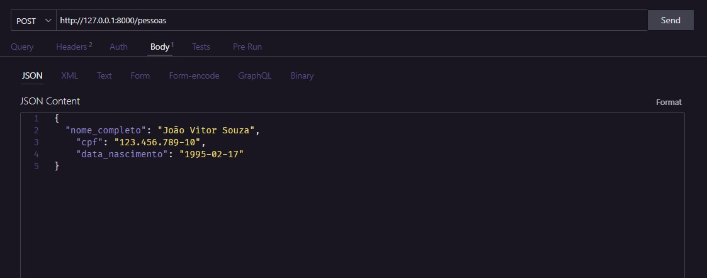
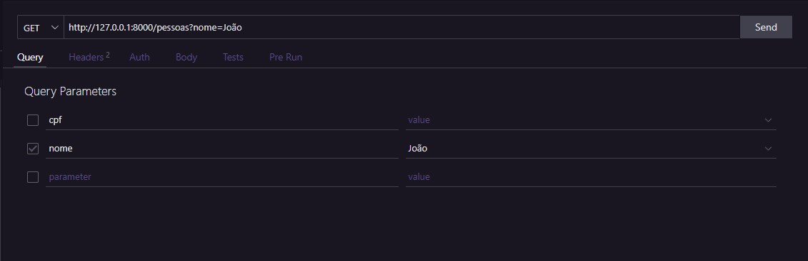
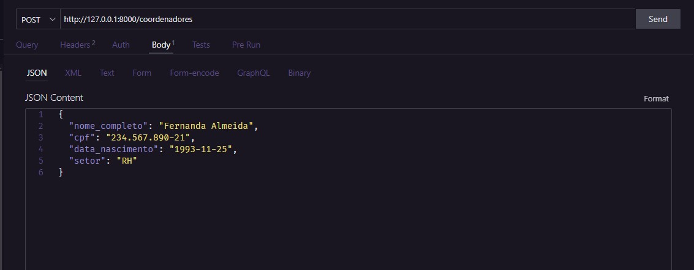
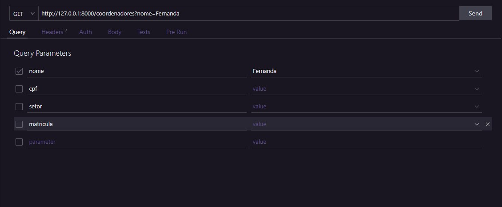
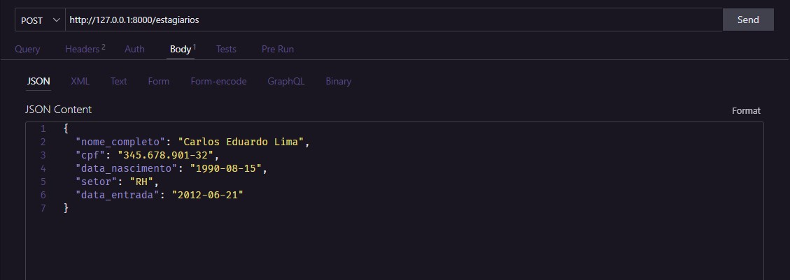
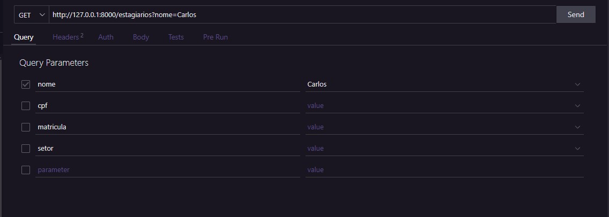

# API de Gerenciamento de Pessoas, Coordenadores e Estagiários

API desenvolvida com FastAPI e MongoDB para gerenciamento de pessoas, coordenadores e estagiários.

---

## 📋 Pré-requisitos

- Python 3.13+
- Conta no [MongoDB Atlas](https://www.mongodb.com/atlas)
- Pip (gerenciador de pacotes Python)

---

## 🛠 Configuração do Ambiente

1. **Clonar o repositório**
   ```bash
   git clone https://github.com/thaleshng/desafio-backend.git
   cd cd desafio-backend

2. **Criar ambiente virtual**
    ```bash
    python -m venv venv
    # Windows:
    venv\Scripts\activate
    # Linux/MacOS:
    source venv/bin/activate

3. **Instalar dependências**
    ```bash
    pip install -r requirements.txt
    pip install python-dotenv  # Para gerenciar variáveis de ambiente

4. **Configurar MongoDB Atlas**
* Acesse seu cluster no Atlas
* Em Database Access, crie um usuário com privilégios de leitura/escrita
* Em Network Access, adicione seu IP (ou 0.0.0.0/0 para acesso público)
* Em Database, obtenha a connection string:
    ```bash
    mongodb+srv://<username>:<password>@clusterX.mongodb.net/?retryWrites=true&w=majority

5. **Criar arquivo .env**
    ```bash
    MONGODB_URI="sua_connection_string_do_atlas"
    DB_NAME="nome_do_seu_banco"

## 🚀 Iniciar o Servidor

```bash
uvicorn app.main:app --reload
```

A API estará disponível em:
http://127.0.0.1:8000/

## 🔍 Documentação Interativa

Explore os endpoints através de:
* Swagger UI: http://127.0.0.1:8000/docs
<br><br>


## 🧪 Ferramentas Recomendadas para Testes

* Postman
* Thunder Client (VS Code Extension)
* curl

## 📡 Exemplos de Requisições

### 🧑 Pessoas
**Criar Pessoa**



**Listar Pessoas com Filtros**



### 👨💼 Coordenadores
**Criar Coordenador**



**Listar Coordenadores com Filtros**



### 👩🎓 Estagiários
**Criar Estagiário**



**Listar Estagiários com Filtros**

